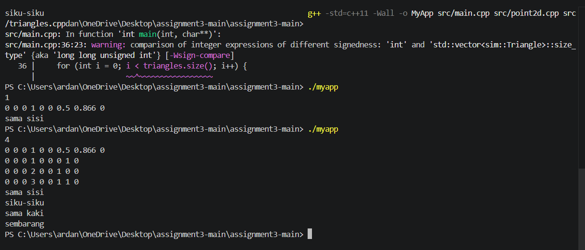

# Laporan Assignment 3 - Simple STL

## Deskripsi Program
Program untuk menentukan jenis segitiga berdasarkan koordinat 3 titik dalam ruang 3D.

## Struktur Class

### Point2D
Class untuk merepresentasikan titik dalam ruang 3D.
- **Atribut:** `_x`, `_y`, `_z`
- **Method:** `GetX()`, `GetY()`, `GetZ()`, `SetX()`, `SetY()`, `SetZ()`
- **Operator:** `+`, `-`, `*`

### Triangle
Class untuk merepresentasikan segitiga dari 3 titik Point2D.
- **Atribut:** `_t1`, `_t2`, `_t3`
- **Method:** `GetT1()`, `GetT2()`, `GetT3()`, `TriangleType()`

## Logika Penentuan Jenis Segitiga
1. Hitung panjang ketiga sisi menggunakan rumus jarak Euclidean
2. **Sama sisi** → ketiga sisi hampir sama panjang
3. **Siku-siku** → memenuhi teorema Pythagoras (a²+b²≈c²)
4. **Sama kaki** → dua sisi hampir sama panjang
5. **Sembarang** → tidak ada sisi yang sama

## Screenshot Input/Output
